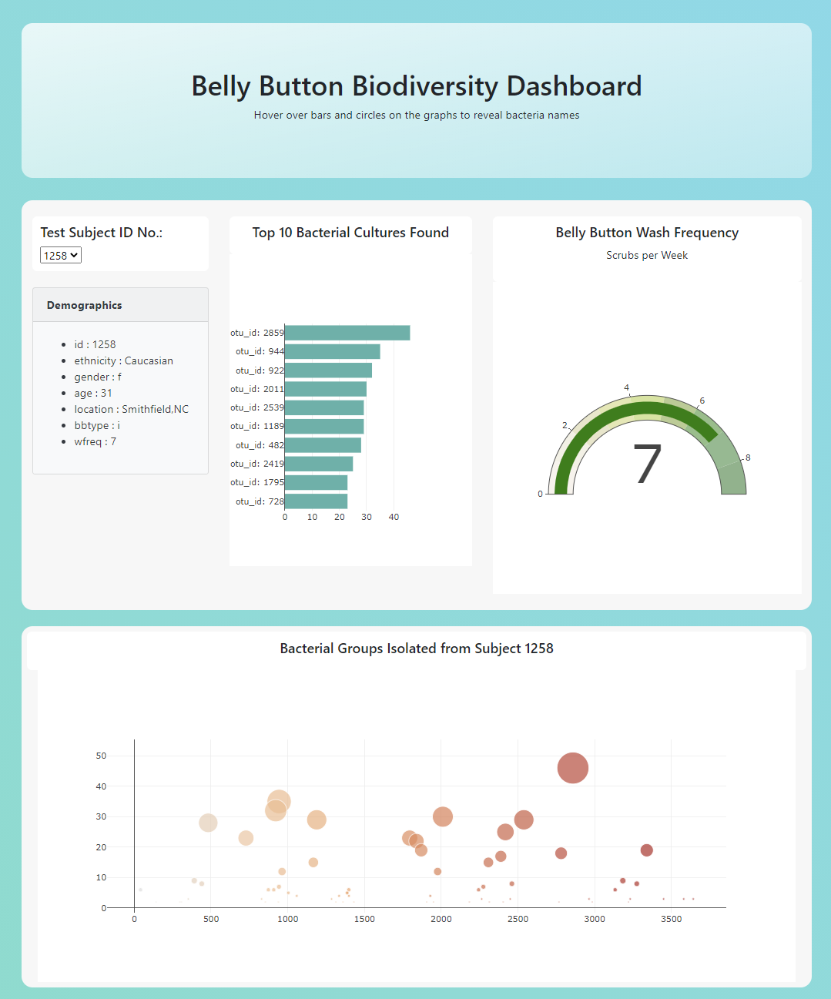

# Belly Button Biodiversity
This project uses javascript to parse through data stored in a json file and display it on an easy to use web page which allows viewers to explore the dataset. 

The data displayed are from a scientific study of bacteria and arachaea from belly buttons! Belly Buttons! :scream_cat:

### Page Link

You can view the hosted page here: [Belly Button Biodiversity](https://nikitacase.github.io/plotly-challenge/) 

And here's a screenshot

### Technology Used

 * Plotly
 
 * Javascript
 
 * HTML5 
 
 * CSS (inclusing bootstrap) 
 
 

### Folder Structure

* index.html - main page displays graphs based on user selected id from a drop down menu 

* static / js 

  * app.js - Has the code which gathers user selection, sorts the JSON file, and generates an html list, a bar graph and a bubble chart 
  
  * bonus.js - Uses a variable from app.js to generate the guage 
  
* data

  * samples.json - data source for the dynamic webpage
  
  
  
### Reference 
Data Source:  NS STATE The Public Science Lab -  [Belly Button Biodiversity](http://robdunnlab.com/projects/belly-button-biodiversity/)

Publications based on this data:

Hulcr J, Latimer AM, Henley JB, Rountree NR, Fierer N, et al. (2012) [A Jungle in There: Bacteria in Belly Buttons are Highly Diverse, but Predictable. PLoS ONE 7(11): e47712.](https://journals.plos.org/plosone/article?id=10.1371/journal.pone.0047712) 

doi:10.1371/journal.pone.0047712

### Another screenshot 

:smile_cat: NikitaCase

